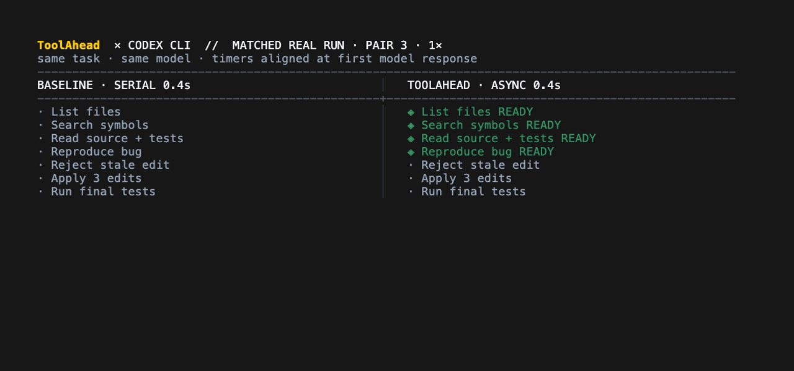
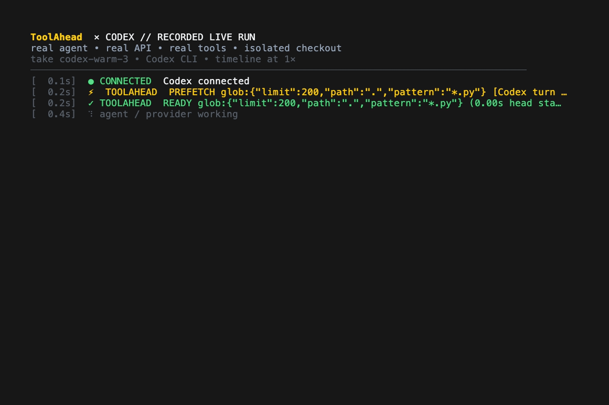
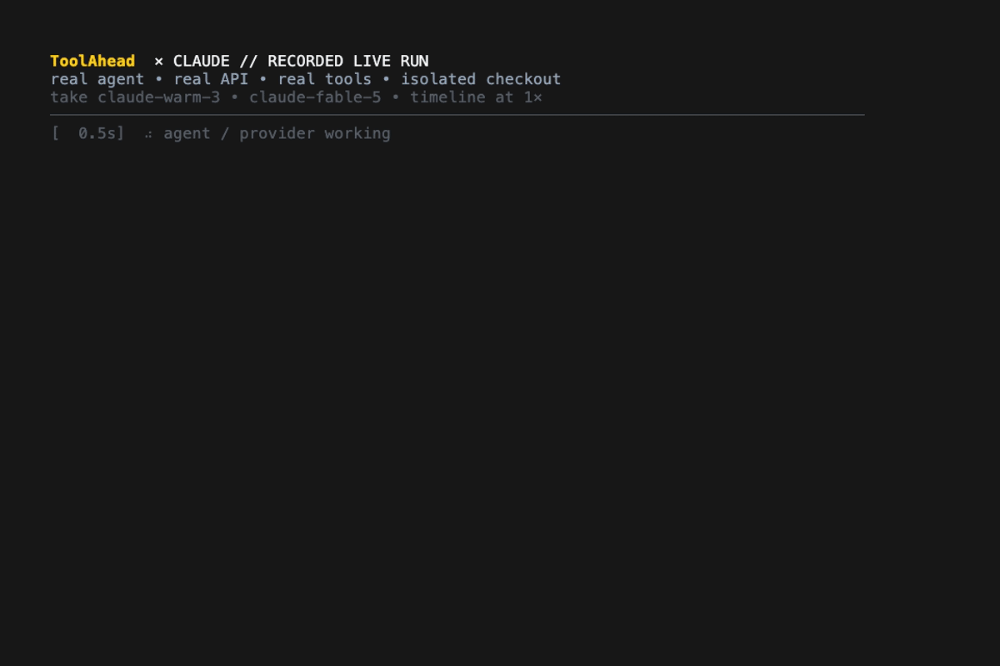
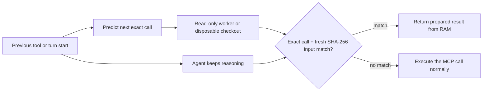

<div align="center">
  

  <h3>Your agent's next tool call, already done.</h3>

  <h3>Up to 28% faster agents.</h3>

  <p><strong>Finish faster. Wait less.</strong></p>

  <p>
    ToolAhead learns recurring tool sequences in a repository and starts safe,
    repeatable calls before Codex or Claude Code requests them. Prepared output
    is returned only when the eventual call and workspace match exactly.
  </p>

  <p>
    
    
    
    
    
    
  </p>
</div>

## Stop waiting for tools

Agents normally work serially:

```text
reason → call tool → wait → inspect → reason → call tool → wait
```

ToolAhead learns which calls usually follow each other. It starts the likely
next call while the model is still working:

```text
Agent       inspect result ───── reason ───── request next tool ── result
ToolAhead                  └──── run predicted tool ──────────────┘
```

The agent still calls ordinary MCP tools. If no matching result is ready, the
tool runs normally. If ToolAhead prepared the exact call against the exact same
files, the result returns immediately from memory.

## See it run

### Codex: the same task with and without ToolAhead

<p align="center">
  
</p>

This is a 1× timeline from a matched Codex pair using the real API and separate
copies of the same project. The protocol and paired Codex/Claude measurements
are in [BENCHMARKS.md](BENCHMARKS.md).

### Full recorded runs

These 1× recordings show ToolAhead handling the complete workflow: list,
search, read, edit, write, test, result validation, and reuse.

#### Codex CLI

<p align="center">
  
</p>

#### Claude Code

<p align="center">
  
</p>

## Install

Once published on PyPI:

```bash
uvx toolahead --help
# or
python3 -m pip install toolahead
```

From a local checkout today:

```bash
git clone https://github.com/michael-ra/toolahead.git
cd toolahead
uvx --from . toolahead --help
```

Requirements: Python 3.11+, macOS or Linux, and an authenticated Codex CLI or
Claude Code installation. `watchdog` is optional.

## Quickstart

Run these commands inside the project you want to accelerate:

```bash
# Connect both agents to ToolAhead and install the required hooks.
uvx toolahead init --agent both --strict --project .

# Allow this exact test command to run ahead and be reused.
uvx toolahead allow "python3 -m pytest" --project .

# Start ToolAhead in the background for this workspace.
uvx toolahead serve --workspace .
```

Then start your agent in a second terminal.

Codex CLI:

```bash
codex
```

Claude Code:

```bash
ANTHROPIC_BASE_URL=http://127.0.0.1:4242 claude
```

See live timing and cache statistics at any time:

```bash
uvx toolahead status
```

Rerun `toolahead init` after upgrading ToolAhead. It refreshes ToolAhead's
project files without changing unrelated Codex, Claude, or MCP settings.

## One clear set of tools

ToolAhead gives the agent one consistent set of MCP tools. This lets it return
prepared results directly instead of waiting for a native tool to run and then
trying to replace its result afterward.

| MCP tool | Familiar input | Can run ahead | Behavior |
| --- | --- | :---: | --- |
| `list_files` | `pattern`, `path`, `limit` | ✓ | Lists matching files |
| `search` | `pattern`, `path`, `glob`, output mode | ✓ | Searches file contents |
| `read_file` | `file_path`, `offset`, `limit` | ✓ | Reads a file with line numbers |
| `edit_file` | `file_path`, `old_string`, `new_string`, `replace_all` | — | Makes an exact edit and starts the next prediction |
| `write_file` | `file_path`, `content` | — | Creates or replaces a file and starts the next prediction |
| `run` | `command`, `description` | ✓ | Runs approved tests, builds, and linters |

The agent never sees cache wrappers or duplicate JSON. ToolAhead keeps cache
timing in hidden MCP `_meta`; prepared and normal calls return the same text,
errors, and exit codes.

### Why `--strict` matters

Showing two equivalent Read tools forces the model to choose between duplicate
options, wastes prompt space, and makes selection less reliable. Strict mode
keeps one set:

- Claude Code's project settings hide native `Read`, `Grep`, `Glob`, `Edit`,
  and `Write`; the six ToolAhead MCP equivalents take their place.
- Codex sees the same six tools and instructions to use them. Strict mode
  redirects native `apply_patch` to `edit_file` so
  edit→test learning stays intact. Codex's general shell remains available when
  needed; explicitly allowed Bash tests can still reuse prepared results.
- Tool names and field conventions stay close to the native coding-agent tools.
  Descriptions are intentionally short to reduce the tokens sent to the model.

Omit `--strict` if you want to keep all native file tools visible while trying
ToolAhead.

## Predictions can be wrong. Returned results cannot.

ToolAhead is free to guess what comes next, but it returns prepared work only
when the requested call and current files are exact matches.



- List, Search, and Read results are tied to the exact request and the relevant
  file contents.
- Command results are tied to the exact command and a fresh hash of the whole
  workspace.
- Commands run ahead only in a disposable workspace copy.
- A prepared result is returned only when the real workspace still matches the
  copy used to create it.
- Wrong predictions, background-process failures, expired results, and
  timeouts automatically fall back to a normal tool execution.
- Cache entries store stdout, stderr, and exit code—not a model-generated
  summary.

ToolAhead learns tool sequences locally. The reliable signal is the previous
tool finishing; visible commentary can offer an earlier hint when an agent
provides it. Private chain-of-thought is never required.

### Latest file change wins

ToolAhead does not need to guess which edit will be the last one. Every
successful Edit or Write increases a simple workspace version number:

```text
edit version 1 ── start predicted tests
edit version 2 ── stop version 1 ── restart tests on version 2
edit version 3 ── stop version 2 ── keep only the version 3 result
```

- A running command for an older file version receives `SIGTERM` as a process
  group, then `SIGKILL` if it does not stop promptly.
- The pending command is restarted for the newest file version even when
  another edit arrives before the test request.
- Writes arriving within 50 ms are grouped before work starts. Configure the
  window with `PREFETCH_MUTATION_DEBOUNCE_MS`; set it to `0` to disable
  grouping.
- Outdated results are never inserted into the current cache. Fresh SHA-256
  validation remains the final replay condition.
- Failed file changes do not increase the workspace version.

In plain terms: after every successful file change, ToolAhead starts the likely
next safe call. Nearby changes are grouped, and a newer change always replaces
work started for an older file state.

## Which commands can be reused

ToolAhead may return a prepared command result instead of running the command
again only when that exact command is listed in `.prefetch-replay.json`:

```json
{
  "commands": [
    "python3 -m pytest",
    "npm test"
  ]
}
```

Use the CLI instead of editing the file by hand:

```bash
toolahead allow "python3 -m pytest" --project .
```

The allowed-command list updates without restarting ToolAhead. It rejects shell
chains, pipes, redirects, substitutions, installers, and arbitrary commands;
recognized test/lint families include unittest, pytest, npm/yarn tests, Go,
Cargo, Make, Jest, Vitest, Ruff, ESLint, TypeScript, and mypy.

### Prioritize known failures without weakening the result

Use the test runner's explicit full-suite mode when available. For pytest,
[`pytest --ff`](https://docs.pytest.org/en/latest/reference/reference.html#cmdoption-ff)
runs the last failures first and then the rest of the suite;
ToolAhead can learn and reuse that exact command normally. Focused modes such
as `pytest --lf` or Jest `--onlyFailures` are useful quick checks, but ToolAhead
never substitutes their partial result for a requested full-suite result.

## Latency metrics

`toolahead status` separates the parts that can otherwise be confused:

| Metric | Meaning |
| --- | --- |
| Agent wait | Time from the previous result until the agent asks for its next tool; includes API, network, model, and reasoning time |
| Prefetch lead | How long ToolAhead had already been running the call before the agent asked for it |
| Replay wait | How much longer the prepared call still needed when the agent requested it |
| Tool wait removed | Native tool runtime minus actual replay/tool phase |
| End-to-end | Total time for the complete task; includes variable agent and API time |
| Acceptance | Prepared calls that exactly matched and were returned |
| Delivery | Prepared command results the agent actually requested and used |

This is why removing 5 seconds of tool waiting does not guarantee the complete
task finishes exactly 5 seconds sooner: model and API response times vary
independently.

## Security model

> [!WARNING]
> A disposable workspace copy is not a security sandbox. Allow only commands
> you already trust. A malicious command can still access the network or write
> to absolute paths outside the copy.

- Tool paths are contained inside the configured workspace; symlink escapes are
  rejected.
- Every command run ahead uses a fresh disposable copy, never the live
  checkout.
- The local daemon binds to `127.0.0.1` and adds no remote telemetry.
- Before returning a prepared result, ToolAhead hashes the current files again.
  Filesystem watchers only help it skip unnecessary hashing.
- Tests that depend on external services, databases, clocks, random values, or
  environment state cannot be validated from source files alone.

## Limitations

- Edit and Write are intentionally not run ahead. After either finishes,
  ToolAhead starts the next predicted safe tool. Rapid changes are grouped, and
  commands running against an older file state are stopped.
- Prepared command results are limited to explicitly approved tests, builds,
  and linters whose output should be repeatable.
- Commands currently verify the entire workspace, which can be conservative on
  very large monorepos. Checking only relevant dependencies is planned.
- API and model response times can outweigh the saved tool time. Compare
  multiple runs with and without ToolAhead instead of relying on one attempt.
- Hosted tools such as provider-side web search cannot be run ahead by this
  local integration.
- Windows has not yet been validated.

## Development

Build and verify the PyPI artifacts:

```bash
uv build
python3 .github/scripts/normalize_sdist.py dist/*.tar.gz
python3 .github/scripts/check_distribution.py dist/*.whl dist/*.tar.gz
uvx --from twine twine check dist/toolahead-0.2.0a2*
uvx --from dist/toolahead-0.2.0a2-py3-none-any.whl toolahead --help
```

## Project map

- `src/toolahead/` — installable CLI, MCP server, prediction engine, hooks,
  sandbox execution, replay, and telemetry
- `docs/assets/` — the logo and README recordings
- `.github/workflows/` — package validation and trusted PyPI publishing
- `.github/scripts/` — release-archive privacy and metadata checks

## Research foundations

ToolAhead is an independent implementation informed by research on speculative
tool execution. It is not an official implementation or reproduction of any
single paper. The closest foundations are:

- [SPORK: Self-Speculative Forking to Accelerate Agentic LLM Inference](https://arxiv.org/abs/2607.03333)
  and [Parallelizing Tool Execution and LLM Generation (PASTE)](https://arxiv.org/abs/2603.18897)
  for overlapping predicted tool execution with ongoing agent reasoning.
- [Speculate with Memory](https://arxiv.org/abs/2607.12236) for learning
  recurring action transitions from previous agent trajectories.
- [SpecBox](https://arxiv.org/abs/2607.23933) for speculative sandbox
  prewarming and isolated execution.
- [AOSpec](https://arxiv.org/abs/2608.00881) for lossless action/state
  verification across speculative execution.

ToolAhead combines these directions with local Codex and Claude Code hooks,
exact call-and-workspace matching, MCP result replay, mutation generations, and
a standalone Python package. All benchmark numbers above are ToolAhead's own
measurements, not results reported by those papers.

## License

MIT License. See [LICENSE](LICENSE).

Contributions are welcome; see [CONTRIBUTING.md](CONTRIBUTING.md). Security
reports should follow [SECURITY.md](SECURITY.md).
